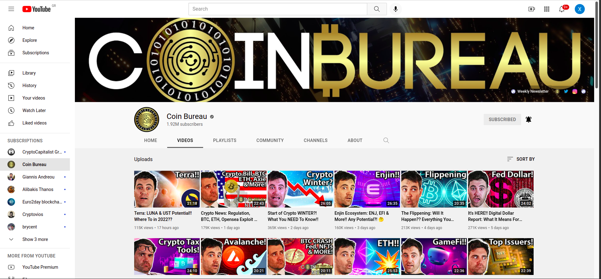

## youtube-clone

**[Test this app yourself](https://cristoforoschoras.github.io/youtube-clone/)**

---

#### Navigation

- About Project
  - _Description_
  - _Developed With_
- How to use this Project
  - _Description_
  - _Developed With_
- Contact
  - _Mail_ 
  - _GitHub_
  - _LinkedIn_
- Used Tools
  - _Fonts_
  - _Design_
  - _Icons_
  - _Colors_

---

### About Project

####youTube - clone

Create a webpage using Html/Css, your page layout should follow the example below.
YouTube app has (Dark/light) mode, you can do dark or light, later when we learn JavaScript we will add this feature to our project.
This project is static, that means there are no functioning buttons or so*.

### How to use this Project

this project has education purposes

##### Developed With

- [x] _HTML5_
- [x] _CSS3_
- [ ] _SASS_
- [ ] _SCSS_
- [ ] _JavaScript_
- [ ] _React_
- [ ] _Bootstrap_
- [ ] _npm_
- [ ] _..._

---

### Contact

Mail: <christopher.choras@yahoo.com> 
GitHub: [Cristoforos choras](https://github.com/CristoforosChoras) 
LinkedIn: [your linkedIn](https://www.linkedin.com/in/christoforos-choras-213220223/)

---

### Used Tools

- [Google Fonts](https://fonts.google.com/)
- [Visual Studio Code](https://code.visualstudio.com/)

---
